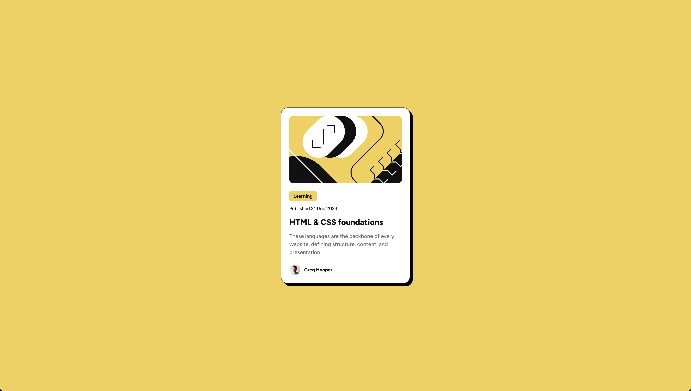

# Frontend Mentor - Blog preview card solution

This is a solution to the [Blog preview card challenge on Frontend Mentor](https://www.frontendmentor.io/challenges/blog-preview-card-ckPaj01IcS). This project demonstrates modern frontend development best practices, focusing on accessibility, performance, and maintainable code.

## Table of contents

- [Overview](#overview)
  - [Screenshot](#screenshot)
  - [Links](#links)
- [My process](#my-process)
  - [Built with](#built-with)
  - [What I learned](#what-i-learned)
  - [Continued development](#continued-development)
  - [Useful resources](#useful-resources)
- [Author](#author)

## Overview

### Screenshot



### Links

- Solution URL: [GitHub Repository](https://github.com/shoyo-22/blog-preview-card)
- Live Site URL: [Live Demo](https://blog-preview-card-ecpkrvj19-shoyo22s-projects.vercel.app/)

## My process

### Built with

- Semantic HTML5 markup
- CSS custom properties
- Flexbox
- Mobile-first workflow
- Performance optimizations
- Accessibility best practices

### What I learned

#### Semantic HTML Structure

```html
<article class="card" role="article" aria-labelledby="card-title">
  <figure class="card__image-container">
    
  </figure>
  <div class="card__content">
    <span class="card__category">Learning</span>
    <h3 class="card__date">Published 21 Dec 2023</h3>
    <h1 id="card-title" class="card__title">HTML & CSS foundations</h1>
    <p class="card__description">
      These languages are the backbone of every website, defining structure,
      content, and presentation.
    </p>
  </div>
</article>
```

#### CSS Architecture with BEM and Custom Properties

```css
:root {
  --white: #fff;
  --yellow: #f4d04e;
  --gray-500: #6b6b6b;
  --gray-950: #111111;

  --spacing-50: 4px;
  --spacing-100: 8px;
  --spacing-150: 12px;
  --spacing-300: 24px;

  --font-family-figtree: "Figtree", sans-serif;
  --font-medium: 500;
  --font-extra-bold: 800;

  --border-radius-xs: 4px;
  --border-radius-sm: 10px;
  --border-radius-lg: 20px;
  --box-shadow: 8px 8px rgba(0, 0, 0);

  --transition-duration: 0.3s;
}

.card {
  max-width: 384px;

  border: 1px solid var(--gray-950);

  border-radius: var(--border-radius-lg);
  background-color: var(--white);
  box-shadow: var(--box-shadow);
}
```

#### Performance Optimizations

- Implemented resource preloading for critical assets
- Optimized image loading with `loading="eager"` and `decoding="async"`
- Used CSS custom properties for efficient theme management
- Implemented reduced motion support for accessibility

#### Accessibility Features

- Proper ARIA roles and labels
- Semantic HTML structure
- Reduced motion support
- High contrast color scheme
- Focus management

### Continued development

Areas for future improvement and focus:

1. **Performance Metrics**

   - Implement Core Web Vitals monitoring
   - Add performance budgets
   - Optimize critical rendering path

2. **Testing**

   - Add automated accessibility testing
   - Implement cross-browser testing
   - Add visual regression testing

3. **Documentation**

   - Add component API documentation
   - Create contribution guidelines
   - Add automated documentation generation

4. **Development Experience**
   - Add development environment setup
   - Implement linting and formatting
   - Add pre-commit hooks

### Useful resources

- [MDN Web Docs - Accessibility](https://developer.mozilla.org/en-US/docs/Web/Accessibility) - Comprehensive guide to web accessibility
- [CSS Custom Properties](https://developer.mozilla.org/en-US/docs/Web/CSS/Using_CSS_custom_properties) - Deep dive into CSS variables
- [BEM Methodology](https://en.bem.info/methodology/) - Official BEM documentation
- [Web Performance](https://web.dev/performance/) - Google's performance optimization guide
- [ARIA Authoring Practices](https://www.w3.org/WAI/ARIA/apg/) - W3C's ARIA best practices

## Author

- Frontend Mentor - [@yourusername](https://www.frontendmentor.io/profile/shoyo-22)
- GitHub - [@shoyo-22](https://github.com/shoyo-22)
